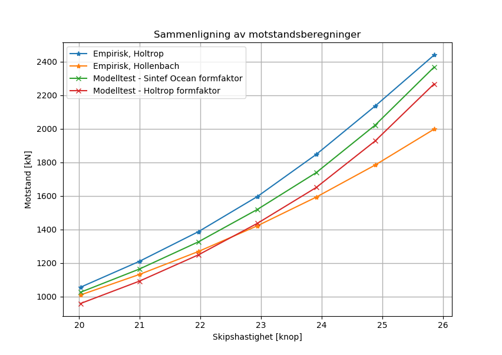

# TMR4247-Python #
Python scripts for the exercises in TMR4247 - Hydrodynamics

## Exercise 9 - Ship resistance calculations ##
Calculating ship resistance with the four following methods:
* Empiric - Hollenbach method
* Empiric - Holtrop method
* Model test - Sintef Ocean form factor
* Model test - Holtrop form factor

